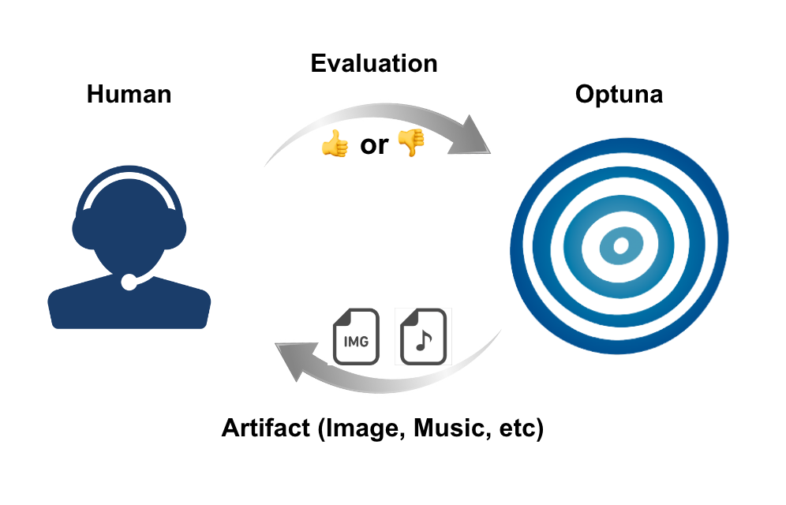
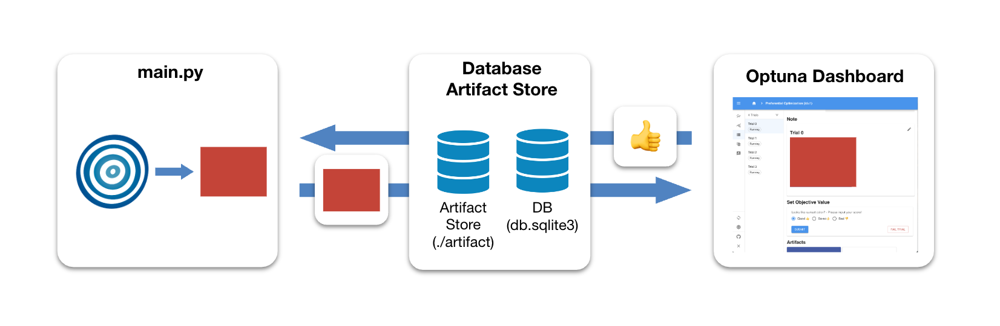
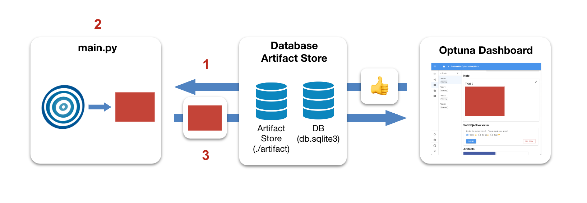
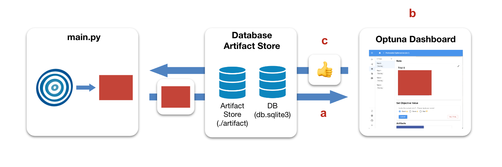
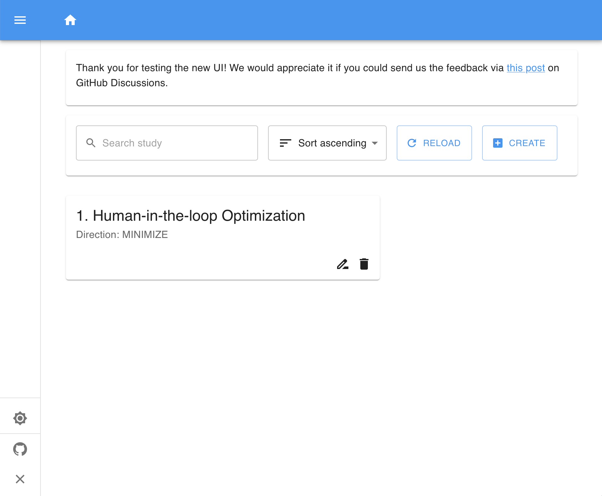
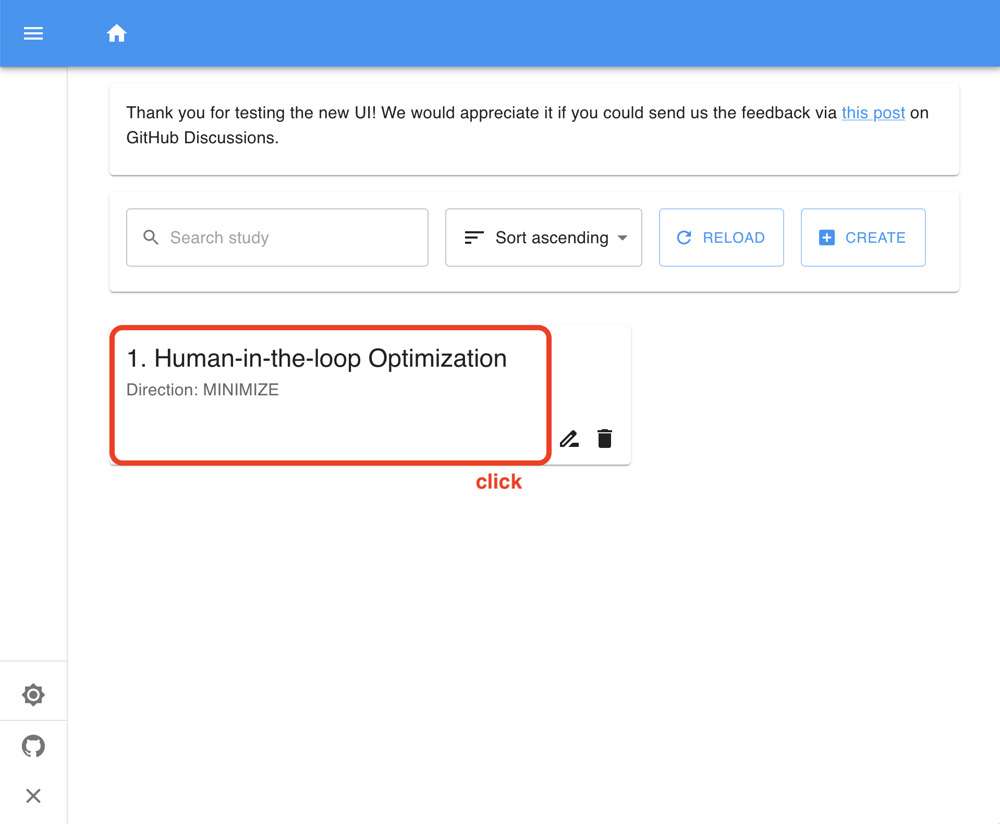
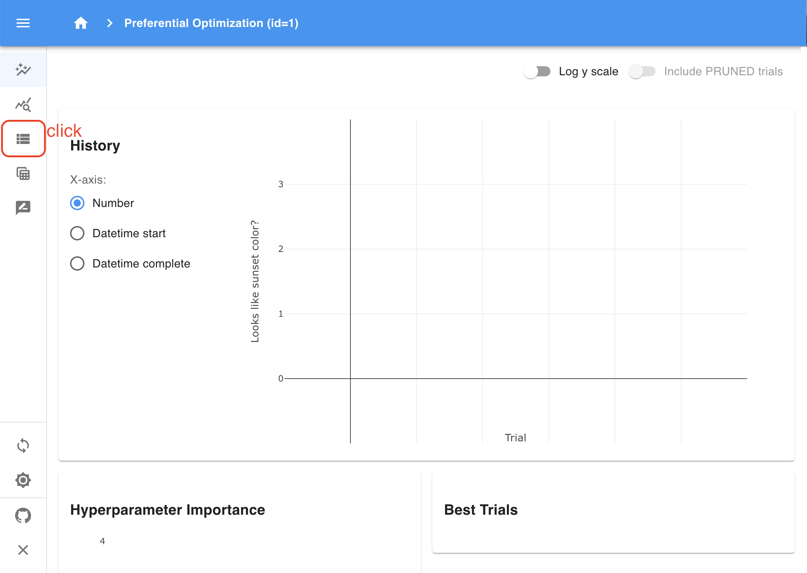
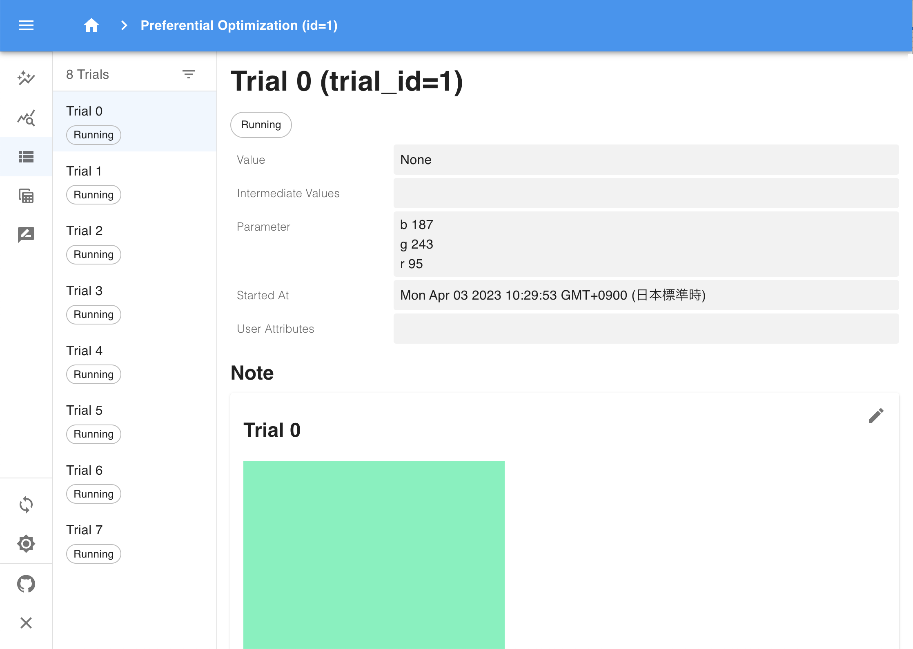
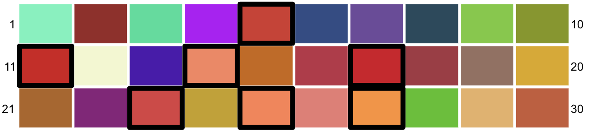
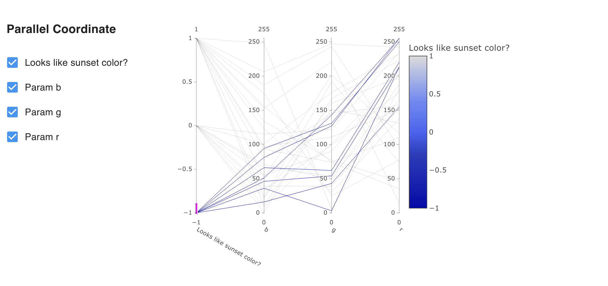

Tutorial: Human-in-the-loop Optimization
========================================

In tasks involving image generation, natural language, or speech synthesis, evaluating results mechanically can be tough, and human evaluation becomes crucial. Until now, managing such tasks with Optuna has been challenging. However, the introduction of Optuna Dashboard enables humans and optimization algorithms to work interactively and execute the optimization process.

In this tutorial, we will explain how to optimize hyperparameters to generate a simple image  using Optuna Dashboard. While the tutorial focuses on a simple task, the same approach can be applied to for instance optimize more complex images, natural language, and speech.

The tutorial is organized as follows:

* What is human-in-the-loop optimization?
* Main tutorial

  * Theme
  * System architecture
  * Steps
  * Script explanation

What is human-in-the-loop optimization?
---------------------------------------

Human-in-the-loop (HITL) is a concept where humans play a role in machine learning or artificial intelligence systems. In HITL optimization in particular, humans are part of the optimization process. This is useful when it's difficult for machines to evaluate the results and human evaluation is crucial. In such cases, humans will assess the results instead.

Generally, HITL optimization involves the following steps:

1. An output is computed given the hyperparameters suggested by an optimization algorithm
2. An evaluator (human) evaluates the output

Steps 1 to 2 are repeated to find the best hyperparameters.

HITL optimization is valuable in areas where human judgment is essential, like art and design, since it's hard for machines to evaluate the output. For instance, it can optimize images created by generative models or improve cooking methods and ingredients for foods like coffee.

Main tutorial
-------------

Theme
~~~~~

In this tutorial, we will interactively optimize RGB values between 0 and 255 to generate a color that the user perceives as the "color of the sunset." If someone already knows the RGB hyperparameter characteristics for their ideal "color of the sunset," they can specify those values directly. However, even without knowing such characteristics, interactive optimization allows us to find good hyperparameters. Although the task is simple, this serves as a practical introduction to human-in-the-loop optimization, and can be applied to image generation, natural language generation, speech synthesis, and more.

.. image:: ./images/hitl2.jpeg
    :width: 45%

To implement HITL optimization, you need a way to interactively execute the optimization process, typically through a user interface (UI) or other means. Usually, users would have to implement their own, but with Optuna Dashboard, everything is already set up for you. This is a major advantage of using Optuna Dashboard for this purpose.

System architecture
~~~~~~~~~~~~~~~~~~~

The system architecture for this tutorial’s example is as follows:

In HITL optimization using Optuna Dashboard, there are primarily the following components:

1. Optuna Dashboard for displaying the outputs and making evaluations
2. Database and File Storage to store the experiment’s data (Study)
3. Script that samples hyperparameters from Optuna and generates outputs

The DB is the place where the information of the Study is stored. The Artifact Store is a place for storing artifacts (data, files, etc.) for the Optuna Dashboard. In this case, it is used as a storage location for the RGB images.

Our script repeatedly performs these steps:

1. Monitor the Study's state to maintain a constant number of Trials in progress (Running).
2. Sample hyperparameters using the optimization algorithm and generate RGB images.
3. Upload the generated RGB images to the Artifact Store.

Additionally, the evaluator, Optuna Dashboard, and Optuna perform the following processes:

a. Optuna Dashboard retrieves the RGB images uploaded to the Artifact Store and displays the retrieved RGB images to the evaluator
b. The evaluator reviews the displayed RGB images and inputs their evaluation of how close the displayed image is to the "color of the sunset" into the Optuna Dashboard
c. Optuna Dashboard saves the evaluation results in the database

In the example of this tutorial, processes 1-3 and a-c are executed in parallel.

Steps
~~~~~

Given the above system, we carry out HITL optimization as follows:

1. Environment setup
2. Execution of the HITL optimization script
3. Launching Optuna Dashboard
4. Interactive HITL optimization

Environment setup
^^^^^^^^^^^^^^^^^

To run `the script <https://github.com/optuna/optuna-dashboard/blob/main/examples/hitl/main.py>`_ used in this tutorial, you need to install two libraries:

.. code-block:: console

    $ pip install "optuna>=3.2.0" "optuna-dashboard>=0.10.0" pillow

You will use SQLite for the storage backend in this tutorial. Ensure that the following library is installed:

* `SQLite <https://sqlite.org/index.html>`_

Execution of the HITL optimization script
^^^^^^^^^^^^^^^^^^^^^^^^^^^^^^^^^^^^^^^^^

Use this command to launch Optuna Dashboard in a separate process.

.. code-block:: console

    $ python main.py

Launching Optuna Dashboard
^^^^^^^^^^^^^^^^^^^^^^^^^^

.. code-block:: console

    $ optuna-dashboard sqlite:///db.sqlite3 --artifact-dir ./artifact

In the command, the storage is set to ``sqlite:///db.sqlite3`` to persist Optuna's trial history. To store the artifacts, ``--artifact-dir ./artifact`` is specified.

.. code-block:: console

    Listening on http://127.0.0.1:8080/
    Hit Ctrl-C to quit.

When you run the command, you will see a message like the one above. Open `http://127.0.0.1:8080/dashboard/ <http://127.0.0.1:8080/dashboard/>`_ in your browser.

Interactive HITL optimization
^^^^^^^^^^^^^^^^^^^^^^^^^^^^^

You will see the main screen.

In this example, a study is created with the name "Human-in-the-loop Optimization." Click on it. You will be directed to the page related to that study.

Click the third item in the sidebar. You will see a list of all trials.

For each trial, you can see its details such as RGB parameter values and importantly, the generated image based on these values. 

.. image:: ./images/hitl11.gif
    :width: 90%

Let's evaluate some of the images. For the first image, which is far from the "color of the sunset," we rated it as "Bad." For the next image, which is somewhat closer to the "color of the sunset," we rated it as "So-so." Continue this evaluation process for several trials. After evaluating about 30 trials, we should see an improvement.

We can review the progress of the HITL optimization through graphs and other visualizations.

.. image:: ./images/hitl12.png

Also, this image is an array of images up to 30 trials. The best ones are surrounded by thick lines.

By looking at the History plot, you can see that colors gradually get closer to the "color of the sunset".

Additionally, by looking at the Parallel Coordinate plot, you can get an insight into the relationship between the evaluation and each hyperparameter.

Various other plots are available. Try exploring.

Script explanation
~~~~~~~~~~~~~~~~~~

Let’s walk through the script we used for the optimization.

.. code-block:: python
    :linenos:

    def suggest_and_generate_image(study: optuna.Study, artifact_backend: FileSystemBackend) -> None:
        # 1. Ask new parameters
        trial = study.ask()
        r = trial.suggest_int("r", 0, 255)
        g = trial.suggest_int("g", 0, 255)
        b = trial.suggest_int("b", 0, 255)
    
        # 2. Generate image
        image_path = f"tmp/sample-{trial.number}.png"
        image = Image.new("RGB", (320, 240), color=(r, g, b))
        image.save(image_path)
    
        # 3. Upload Artifact
        artifact_id = upload_artifact(artifact_backend, trial, image_path)
        artifact_path = get_artifact_path(trial, artifact_id)
    
        # 4. Save Note
        note = textwrap.dedent(
            f"""\
        ## Trial {trial.number}
    
        
        """
        )
        save_note(trial, note)

In the ``suggest_and_generate_image`` function, a new Trial is obtained and new hyperparameters are suggested for that Trial. Based on those hyperparameters, an RGB image is generated as an artifact. The generated image is then uploaded to the Artifact Storage of the Optuna Dashboard, and the image is also displayed in the Dashboard's Note. For more information on how to use the Note feature, please refer to the API Reference of :func:`~optuna_dashboard.save_note`.

.. code-block:: python
    :linenos:

    def start_optimization(artifact_backend: FileSystemBackend) -> NoReturn:
        # 1. Create Study
        study = optuna.create_study(
            study_name="Human-in-the-loop Optimization",
            storage="sqlite:///db.sqlite3",
            sampler=optuna.samplers.TPESampler(constant_liar=True, n_startup_trials=5),
            load_if_exists=True,
        )

        # 2. Set an objective name
        study.set_metric_names(["Looks like sunset color?"])

        # 3. Register ChoiceWidget
        register_objective_form_widgets(
            study,
            widgets=[
                ChoiceWidget(
                    choices=["Good 👍", "So-so👌", "Bad 👎"],
                    values=[-1, 0, 1],
                    description="Please input your score!",
                ),
            ],
        )
    
        # 4. Start Optimization
        n_batch = 4
        while True:
            running_trials = study.get_trials(deepcopy=False, states=(TrialState.RUNNING,))
            if len(running_trials) >= n_batch:
                time.sleep(1)  # Avoid busy-loop
                continue
            suggest_and_generate_image(study, artifact_backend)

The function ``start_optimization`` defines our loop for HITL optimization to generate an image resembling a sunset color.

* First, at #1, a Study of Optuna is created using TPESampler. Setting ``load_if_exists=True`` allows a Study to exist and be reused and the experiment to be resumed if it has already been created. The reason for setting ``constant_liar=True`` in TPESampler is to prevent similar hyperparameters from being sampled even if the trial is executed several times simultaneously (in this example, four times).
* At #2, the name of the objective that the :class:`~optuna_dashboard.ChoiceWidget` targets is set using the `study.set_metric_names <https://optuna.readthedocs.io/en/latest/reference/generated/optuna.study.Study.html#optuna.study.Study.set_metric_names>`_ function. In this case, the name "Looks like sunset color?" is set.
* At #3, the :class:`~optuna_dashboard.ChoiceWidget` is registered using the :func:`~optuna_dashboard.register_objective_form_widgets` function. This widget is used to ask users for evaluation to find the optimal hyperparameters. In this case, there are three options: "Good 👍", "So-so👌", and "Bad 👎", each with an evaluation value of -1, 0, and 1, respectively. Note that Optuna minimizes objective values by default, so -1 is Good. Other widgets for evaluation are also available, so please refer to the API Reference for details.
* At #4, the ``suggest_and_generate_image`` function is used to generate an RGB image. Here, the number of currently running (TrialState.RUNNING) trials is periodically checked to ensure that four trials are running simultaneously. The reason why trials are executed in batches like this is that it generally may take a long time to obtain results from trial execution. By performing batch parallel processing, time waiting for the next results can be reduced. In this case, because generating the images is instant, it’s not necessary, but demonstrates practices.

.. code-block:: python
    :linenos:

    def main() -> NoReturn:
        tmp_path = os.path.join(os.path.dirname(__file__), "tmp")

        # 1. Create Artifact Store
        artifact_path = os.path.join(os.path.dirname(__file__), "artifact")
        artifact_backend = FileSystemBackend(base_path=artifact_path)
    
        if not os.path.exists(artifact_path):
            os.mkdir(artifact_path)
    
        if not os.path.exists(tmp_path):
            os.mkdir(tmp_path)
    
        # 2. Run optimize loop
        start_optimization(artifact_backend)

In the ``main`` function, at first, the locations of the Artifact Store is set.

* At #1, the :class:`~optuna_dashboard.FileSystemBackend` is created, which is one of the Artifact Storage options used in the Optuna Dashboard. Artifact Storage is used to store artifacts (data, files, etc.) generated during Optuna trials. For more information, please refer to the API Reference.
* At #2, `start_optimization()` function, which is described above, is called.

After that, two folders are created, artifact and tmp, and then ``start_optimization`` function is called to start the HITL optimization using Optuna.
