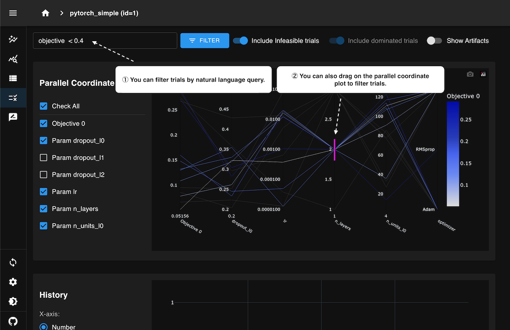

.. _llm-integration:

Tutorial: LLM Integration
=========================

This tutorial explains how to enable and use the LLM (Large Language Model) integration of Optuna Dashboard.
With an LLM provider configured, you can interact with the optimization history using natural language—for example, filtering trials or generating Plotly visualizations.

Overview
--------
The LLM integration adds AI-assisted features on top of the existing dashboard experience. Currently supported capabilities include:

- Natural language to trial-filter function generation
    - Example query: "Show completed trials where param x is between 1 and 5 and the objective value is below -10"
    - The model returns a JavaScript function, which is safely evaluated client-side to filter trials.
- Automatic generation of Plotly charts from natural language prompts.
    - Example query: "Draw a parallel coordinates plot to visualize the relationships between the objective value and the hyperparameters."
    - The model returns a JavaScript function to generate Plotly charts.

Supported providers: :class:`~optuna_dashboard.llm.openai.OpenAI`, :class:`~optuna_dashboard.llm.openai.AzureOpenAI`, and OpenAI-compatible endpoints.

Usage
-----

Command-line Interface
~~~~~~~~~~~~~~~~~~~~~~

Configuration is typically provided in a TOML file and passed with ``--from-config``.

.. code-block:: toml

   [optuna_dashboard]
   storage = "sqlite:///example.db"
   port = 8080

   [llm.openai]
   model = "gpt-5-mini"             # Model name
   use_chat_completions_api = true  # If true uses Chat Completions API; otherwise Responses API

   [llm.openai.client]
   api_key = "sk-your-api-key"      # For security, you can omit this line and keep the secrets in the OPENAI_API_KEY environment variable.
   base_url = "https://api.openai.example.com/v1"  # Set for compatible services

Once you have a config file:

.. code-block:: bash

   optuna-dashboard --from-config config.toml

For more details on configuration, see :ref:`configuration-llm-integration`.

Python API
~~~~~~~~~~

You can launch the dashboard programmatically and provide an ``llm_provider``.
The examples below mirror the structure of the TOML configuration but give you full control in Python.

.. code-block:: python

   import os
   import openai
   from optuna_dashboard.llm.openai import OpenAI
   from optuna_dashboard import run_server

   client = openai.OpenAI(
       api_key=os.environ["OPENAI_API_KEY"],
       # base_url="https://api.openai.example.com/v1",  # Uncomment for compatible endpoints
   )
   llm_provider = OpenAI(client, model="gpt-5-mini", use_chat_completions_api=False)

   run_server(
       storage="sqlite:///example.db",
       port=8080,
       llm_provider=llm_provider,
   )

Features
--------

Smart Filtering
~~~~~~~~~~~~~~~

One of the features enabled when an LLM provider is configured is **Smart Filtering**.
With smart filtering, you can input filter conditions in natural language.
The LLM then generates a corresponding JavaScript function, which is applied to filter trials dynamically.

This feature is currently available in the "Smart Selection" and "Trial (List)" tabs.
For example, in the "Smart Selection" tab, you can use it as follows:

As shown in the animation above, when you specify conditions in natural language in the filter input field, the results are reflected in the parallel coordinates plot, optimization history plot, and trial table.
It also supports multiple conditions combined together, such as:

``objective < 0.5 and (param_a < 0.1 or param_b > 10) and state is complete``

Automatic Plotly Charts Generation
~~~~~~~~~~~~~~~~~~~~~~~~~~~~~~~~~~

TBD. This feature is under the development; documentation will be added in a future update.
