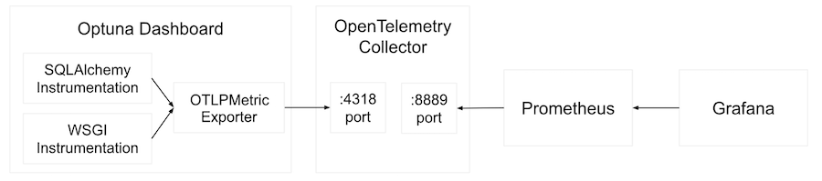

.. _tutorial-open-telemetry:

Tutorial: Integrating with OpenTelemetry
========================================

This tutorial shows how to integrate Optuna Dashboard with OpenTelemetry to collect metrics and monitor your hyperparameter optimization workloads using Prometheus and Grafana.

Overview
--------

`OpenTelemetry <https://opentelemetry.io/>`__ is an observability framework that enables easy instrumentation of our applications and systems.
By integrating Optuna Dashboard with OpenTelemetry, you can:

* Monitor HTTP request metrics (latency, error rates, throughput)
* Track database query performance
* Export metrics to Prometheus for storage and visualization in Grafana

Architecture
------------

The example setup uses the following components:

1. **Optuna Dashboard** - The web application with OpenTelemetry instrumentation
2. **OpenTelemetry Collector** - Receives metrics and forwards them to Prometheus
3. **Prometheus** - Time-series database for storing metrics
4. **Grafana** - Visualization dashboard for metrics

Prerequisites
-------------

* Docker and Docker Compose
* Python 3.12+

Getting Started
---------------

Clone the repository and navigate to the OpenTelemetry example:

.. code-block:: bash

   git clone https://github.com/optuna/optuna-examples
   cd optuna-examples/dashboard/opentelemetry

Project Structure
-----------------

The example directory contains:

* ``main.py`` - Optuna Dashboard with OpenTelemetry instrumentation
* ``docker-compose.yml`` - Services for Prometheus, Grafana, and OpenTelemetry Collector
* ``otel-collector-config.yml`` - OpenTelemetry Collector configuration
* ``prometheus.yml`` - Prometheus scraping configuration
* ``requirements.txt`` - Python dependencies

Setting Up the Environment
--------------------------

1. **Install Dependencies**

   Install the required Python packages:

   .. code-block:: bash

      pip install -r requirements.txt

2. **Start the Monitoring Stack**

   Use Docker Compose to start Prometheus, Grafana, and the OpenTelemetry Collector:

   .. code-block:: bash

      docker-compose up -d

   This will start:

   * **Prometheus** on http://localhost:9090/metrics
   * **Grafana** on http://localhost:13000
   * **OpenTelemetry Collector** with OTLP receivers on a port and 4318 (HTTP)

3. **Create SQLite3 database (db.sqlite3) and start Optuna Dashboard server**

   Run hyperparameter optimization with SQLite3 database (file name: ``db.sqlite3``).

   .. code-block:: pycon

      >>> import optuna
      >>> study = optuna.create_study(
      ...     storage="sqlite:///db.sqlite3",
      ...     study_name="simple-quadratic"
      ... )
      ...
      >>> def objective(trial):
      ...     x = trial.suggest_float("x", -10, 10)
      ...     return (x - 5) ** 2
      ...
      >>> study.optimize(objective, n_trials=100)

   Run the instrumented Optuna Dashboard:

   .. code-block:: bash

      python main.py

   The dashboard will be served at http://localhost:8080

4. **Access to Grafana dashbaord**

   Access Grafana at http://localhost:13000 (default login: admin/admin) to create dashboards:

   To view the prometheus metrics on Grafana, please go to "Data sources" > "Prometheus" and enter http://prometheus:9090 in the "Prometheus URL" form, then, you can create the custom dashboard.
   For details how to create a custom Grafana dashboard, please refer to `Grafana dashboards overview - Grafana Cloud documentation <https://grafana.com/docs/grafana-cloud/introduction/dashboards/>`__.

   .. figure:: ./images/opentelemetry/grafana.png
      :alt: Grafana Dashboard
      :align: center
      :width: 800px

Code Explanation
----------------

The ``main.py`` file demonstrates how to instrument Optuna Dashboard with OpenTelemetry:

**1. Configure OpenTelemetry Metrics**

.. code-block:: python

   from opentelemetry import metrics
   from opentelemetry.sdk.metrics import MeterProvider
   from opentelemetry.sdk.resources import Resource
   from opentelemetry.sdk.metrics.export import PeriodicExportingMetricReader
   from opentelemetry.exporter.otlp.proto.http.metric_exporter import OTLPMetricExporter

   # Set up resource identification
   resource = Resource.create({"service.name": "optuna-dashboard"})
   
   # Configure OTLP metric exporter
   readers = [
       PeriodicExportingMetricReader(
           OTLPMetricExporter(endpoint="http://localhost:4318/v1/metrics"),
           export_interval_millis=1000,
           export_timeout_millis=5000,
       ),
   ]
   
   # Set up the meter provider
   metrics.set_meter_provider(MeterProvider(resource=resource, metric_readers=readers))

**2. Instrument SQLAlchemy for Database Metrics**

.. code-block:: python

   from opentelemetry.instrumentation.sqlalchemy import SQLAlchemyInstrumentor

   storage = RDBStorage("sqlite:///db.sqlite3")
   SQLAlchemyInstrumentor().instrument(
       engine=storage.engine,
       meter_provider=metrics.get_meter_provider(),
   )

This automatically captures database operation metrics including:

* Query execution time
* Connection pool metrics
* Database transaction counts

Please refer to the `OpenTelemetry SQLALchemy Instrumentation - OpenTelemetry Python Contrib <https://opentelemetry-python-contrib.readthedocs.io/en/latest/instrumentation/sqlalchemy/sqlalchemy.html>`__ for details.

**3. Instrument WSGI for HTTP Metrics**

.. code-block:: python

   from opentelemetry.instrumentation.wsgi import OpenTelemetryMiddleware

   app = optuna_dashboard.wsgi(storage=storage)
   app = OpenTelemetryMiddleware(app, meter_provider=metrics.get_meter_provider())

This captures HTTP metrics such as:

* Request duration
* Request count by status code
* Active request count

Please refer to the `WSGI Instrumentation - OpenTelemetry Python Contrib <https://opentelemetry-python-contrib.readthedocs.io/en/latest/instrumentation/wsgi/wsgi.html>`__ for details.

Alternative: Direct Prometheus Export
-------------------------------------

Instead of using the OpenTelemetry Collector, you can export metrics directly to Prometheus:

.. code-block:: python

   from prometheus_client import start_http_server
   from opentelemetry.exporter.prometheus import PrometheusMetricReader

   # Start Prometheus metrics server
   start_http_server(port=9464, addr="127.0.0.1")
   readers.append(PrometheusMetricReader("optuna_dashboard"))

This approach exposes metrics directly at http://localhost:9464/metrics without requiring an OpenTelemetry Collector.

Configuration Options
---------------------

**OpenTelemetry Collector Configuration**

The ``otel-collector-config.yml`` file configures how metrics are processed:

.. code-block:: yaml

   receivers:
     otlp:
       protocols:
         http:
           endpoint: otel-collector:4318
   
   processors:
     batch:  # Batches metrics for efficient export
   
   exporters:
     prometheus:
       endpoint: "0.0.0.0:8889"  # Prometheus metrics endpoint
   
   service:
     pipelines:
       metrics:
         receivers: [otlp]
         processors: [batch]
         exporters: [prometheus]

**Metric Export Intervals**

Adjust the export frequency in your Python code:

.. code-block:: python

   PeriodicExportingMetricReader(
       OTLPMetricExporter(endpoint="http://localhost:4318/v1/metrics"),
       export_interval_millis=5000,  # Export every 5 seconds
       export_timeout_millis=10000,  # 10 second timeout
   )
