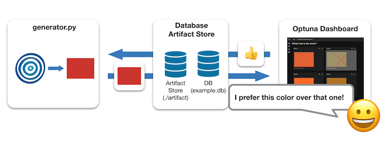
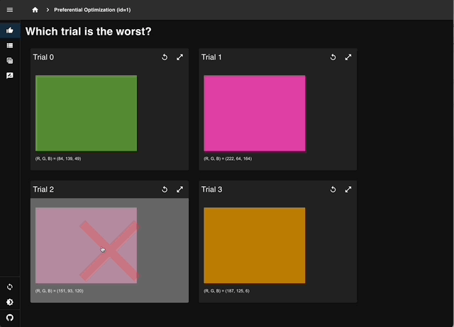

Tutorial: Preferential Optimization
===================================

What is Preferential Optimization?
----------------------------------

Preferential optimization is the way to optimize hyperparameters based on human preferences,
specifically by determining which trial is better when given a pair to compare.
Compared to the `human-in-the-loop optimization utilizing objective form widgets <tutorial-hitl-objective-form-widgets>`_,
which relies on absolute evaluations, preferential optimization significantly reduces fluctuations in the evaluators' criteria,
ensuring more consistent results.

In this tutorial, we will interactively optimize RGB values between 0 and 255 to generate a color that resembles the "sunset hue", which is the same problem setting as `this tutorial <tutorial-hitl-objective-form-widgets>`_.
Hence, familiarizing yourself with the tutorial on objective form widgets beforehand might offer a smoother understanding.

How to Run Preferential Optimization
------------------------------------

In preferential optimization, we run two programs simultaneously: `generator.py`_ which executes parameter sampling or image generation,
and the Optuna Dashboard which provides a user interface for human evaluation.



To start, ensure you have the necessary packages installed. You can do this by running the following command in your terminal:

.. code-block:: console

    $ pip install "optuna>=3.3.0" "optuna-dashboard>=0.13.0b1" pillow botorch

Run a Python script below which you copied from `generator.py`_.

.. code-block:: console

   $ python generator.py

Then run a following command to launch Optuna Dashboard in a separate process.

.. code-block:: console

    $ optuna-dashboard sqlite:///example.db --artifact-dir ./artifact

In the command, the storage is set to ``sqlite:///example.db`` to persist Optuna's trial history.
To store the artifacts (output images), ``--artifact-dir ./artifact`` is specified.

.. code-block:: console

    Listening on http://127.0.0.1:8080/
    Hit Ctrl-C to quit.

When you run the command, you will see a message like the one above.
Please open `http://127.0.0.1:8080/dashboard/ <http://127.0.0.1:8080/dashboard/>`_ in your browser, then you can see the Optuna Dashboard as follows:



   Selecting the least sunset-like color from four trials to report human preferences.


Script Explanation
------------------

Here, we specify the SQLite database URL and setup the artifact store, a filesystem to store images generated during the trial.

.. code-block:: python
   :linenos:

   STORAGE_URL = "sqlite:///example.db"
   artifact_path = os.path.join(os.path.dirname(__file__), "artifact")
   artifact_store = FileSystemArtifactStore(base_path=artifact_path)
   os.makedirs(artifact_path, exist_ok=True)

Within the ``main()`` function, we initialize the study with necessary parameters, including specifying the preferential sampler.
ote that the ``Study`` and ``Sampler`` instantiated here are different from the conventional Optuna's ``Study``` and the ``Sampler``.
Preferential optimization relies solely on the comparison results between trials, and there are no absolute evaluation values for each trial.
Therefore, it is necessary to create dedicated ``Study`` and ``Sampler`` objects.

.. code-block:: python
   :linenos:

   from optuna_dashboard.preferential import create_study
   from optuna_dashboard.preferential.samplers.gp import PreferentialGPSampler

   study = create_study(
       n_generate=5,
       study_name="Preferential Optimization",
       storage=STORAGE_URL,
       sampler=PreferentialGPSampler(),
       load_if_exists=True,
   )

Then, we create a loop that continuously checks if new trials should be generated, awaiting human evaluation if not.
Within the while loop, new trials are generated if the condition :meth:`~optuna_dashboard.preferential.PreferentialStudy.should_generate` returns ``True``. 
For each trial, RGB values are sampled, and an image is generated with these values.
The image is saved temporarily, uploaded to artifact store, and then saved a Markdown note using :func:`~optuna_dashboard.save_note`.

.. code-block:: python
   :linenos:

   while True:
       # If study.should_generate() returns False, the generator waits for human evaluation.
       if not study.should_generate():
           time.sleep(0.1)  # Avoid busy-loop
           continue

       trial = study.ask()
       # Ask new parameters
       r = trial.suggest_int("r", 0, 255)
       g = trial.suggest_int("g", 0, 255)
       b = trial.suggest_int("b", 0, 255)

       # Generate an image
       image_path = os.path.join(tmpdir, f"sample-{trial.number}.png")
       image = Image.new("RGB", (320, 240), color=(r, g, b))
       image.save(image_path)

       # Upload to Artifact store
       artifact_id = upload_artifact(trial, image_path, artifact_store)
       trial.set_user_attr("artifact_id", artifact_id)
       print("RGB:", (r, g, b))

       # Save a Markdown note
       note = textwrap.dedent(
           f"""\
       })

       (R, G, B) = ({r}, {g}, {b})
       """
       )

.. _generator.py: https://github.com/optuna/optuna-dashboard/blob/main/examples/preferential-optimization/generator.py
